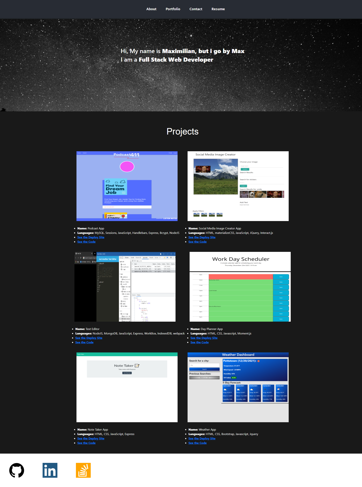

# react-port

## Description
I was tasked with making a react portfolio to demonstrate personal projects to future employers. The goal was to make a webpage that is visually appealing with access to projects I have completed. Utilizing React, I was able to create a react webpage that is both desktop and mobile friendly. 

## Table of Contents
- [Installation](#installation)
- [Usage](#usage)
- [Credits](#credits)
- [License](#license)

## Installation
N/A

## Usage
Here is the deployed link to my portfolio. [My portfolio](https://maxstump13.github.io/react-port/) Below is what the site looks like on screens larger than 7able to open a dropdown menu. These menus have the links to the repos and the deployed applications. These features are displayed below. 

## Credits
Here are the sources I used to create my portfolio.
1. [CSS-tricks](https://css-tricks.com/)
2. [Stackoverflow](https://stackoverflow.com/)
3. [W3schools](https://www.w3schools.com/default.asp)
4. [MDN](https://developer.mozilla.org/en-US/)
5. [React](https://reactjs.org/)
6. [Bootstrap](https://getbootstrap.com/)
7. []
## License
[Mit Licesne](./LICENSE)

## Badges
N/A

## How to Contribute
If there are any suggestions to improve this generator, this is my [GitHub](https://github.com/MaxStump13) account.

## Tests
N/A